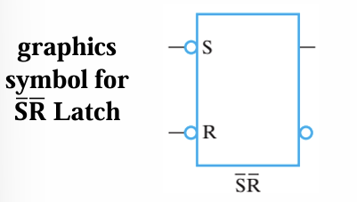
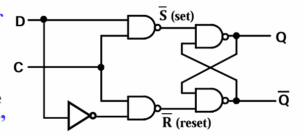

# Sequential Circuit

## 引入

    学习这一章的时候思路需要部分跳出组合逻辑的状态
    这一章与组合逻辑最大的差别如下

        1. 思考问题时候必须考虑逻辑门的延迟
        2. 同级门的输出可以作为同级另一门的输入
        3. 一个电路可以没有外部输入（输入可以由锁存器来提供），外部输出（结果可以存入锁存器）
   
## Storing State

对一个2-1选择器，做这样以一个修改，就成为了一个可以记住状态的器件

记住的逻辑如下：
因为它满足这个逻辑递推式子：

我们适当的做一些递推

利用这个递推的式子我们就可以画出这样一个表格：

所以就可以列出遮这样一个表格：

但是当我们对这个东西适当做一些调整结果就会很不一样：

加一个非门之后逻辑也同样做分析，结果结果就会出现自我反转

称这种bug为：Oscillation

## Oscillation ERROR
很专业的解释就是一个锁存器不能稳定的存储一个状态！！！

## Latches

能满足所存的器件要求：
1. 可以存储两态
2. 存储的信号必须稳定
3. 在稳定状态的时候可以切换状态

将上面的电路修改的对称一点，将或换成连线就获得了下面这张图：

做适当的推导：

他的运作数值图如下：

解释：

    1. 哪一个输入的方向的输入值为低，那么这个方向的输出值也为低
    2. 如果同时为1，那么结果不改变，存的是上一步操作的结果
    3. 全为0在恢复全为1的时候会发生O Error
器件图：

## Basic (NOR)  S – R Latch

    这是另一个同样能实现锁存的器件组合
    但不同的是可以实现高电平激活

    运作逻辑图：

器件图：

## Clocked S – R Latch: Synchronous Circuit

我需要添加一个功能就是我希望这个器件能够实现在我想要它发生更新的时候才发生更新

增加一个clock做与非操作就行：

注意：

    这里使用的是与非操作，所以整个器件的逻辑变成了高电平激活！！！但是激活的同侧输出仍然是0！！！

器件图片:

## 但这个器件其实还存在两个问题
1. 很明显就是当全激活的时候会震荡
2. 而且因为器件的生产的天然误差，最后它会震荡停留在一个稳定点，这个稳定点的位置会有三个，其中一个还是不稳定点

## Unstable Latch Behavior (Metastable State) 不稳定点
这个问题主要出现在，如果都没有激活的情况（两个输入都为1的时候）

为了方便理解，将原电路化简成

之所以能这么化简是因为保证了两个输入都恒为1

做出两者的特性曲线发现不动点存在三个

也就是在两个非门可以同时稳定在一个中间过渡阶段（自己迭代试试确实可以稳定在这个点）

## Avoiding Unstable Behavior of Latches

    思路很简单就是不要出现双激活就行：

用一个表格来简单的阐释运作逻辑：

解释：

    如果D为1，就清空Q的状态;D为1，加载Q的状态

## 现在我们要实现一个简单的二进制进位器，运用latch

对于一位输入我们运用这样一个器件（flip-flop）：

解释：
     
     1. 如果C在被激活了很短的时间，那么Q存储的状态就会反转一次，
     2. 如果C长时间被激活，那么Q结果就会一直翻转;

进位器的波形如下：

解释：

    很好的解释了clock时钟需要激活的时间是很短的，因为clock一旦被激活一次，器件就要反转一次；

    并且将前一个的Q输出端接到下一位的输入clock端，就可以实现很好的随着时间进位的效果。

但是这个地方会有一个东西很难实现就是需要去好好规定clock的尖峰延时不能太长

#### 我希望有一个能够在一次时间变化中只接受一次变化的器件

## 概念补充，trigger

    控制信号（clock/control）的信号发生改变我们成为有一个trigger

## S-R Master-Slave Flip-Flop(a pulse-triggered or 
level-triggered flip-flop) 

其结构图如下：

优势：
    
    1. 将输入和输出分离做处理，并且使用一个clock接上非门的操作来实现能一开一闭：
        1. clock为高电平的时候，Master工作/接受存储更新，Slave不工作/不接受更新
        2. clock为低电平的时候，Mastre不工作/不接受存储更新，Slave工作/接受存储更新
     2. 这样就可以很轻易的实现：只有在clock激活熄灭完成一整个过程之后才会更新一次最后的结果

这就很好的能够满足上面进行进位的要求

器件图片：

#### 但是呢这个器件还是会存在一个问题，就是如果出现了一个毛刺信号
    比如：在C变成1之后，R保持为0，S=1（突然），那么master就会错位的将这一个干扰计入结果

解释：
    
    1. 因为当出现双不激活的状态的时候，存储状态不会改变，只会保留上一次的存储值
    2. 所以当S突然升高之后，Y激活的记录在S恢复之后不会被改变而被存储，所以会出现记录的突变状况的问题！！！

## Negative-Edge-Triggered D Flip-Flop

    这个器件将输入作为单输入就可以避免出现记录下这个毛刺信号 

波形图如下：

解释：

    将双输入合并成单输入，Y记录的值始终与D一样，不会错误存储，那么最终slave更新的值就只会是最后状态的数值，也就是正常值。

结合上上面这一点,解决毛刺突变信号的方式：

    1. 用单输入
    2. 采样的时间空间（就是clock缩短）->这样毛刺出现在采样区间内的概率就小了！！！

