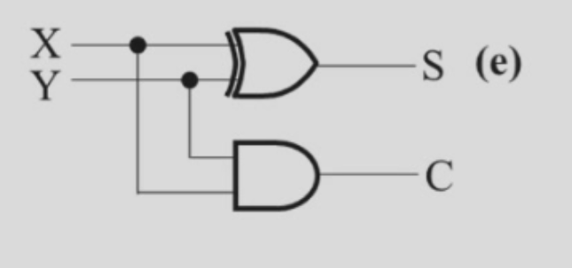
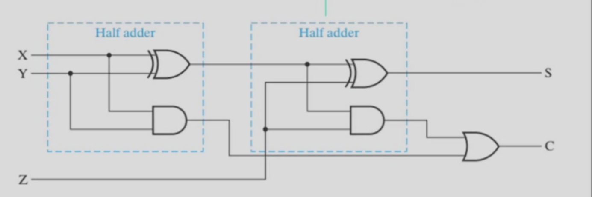
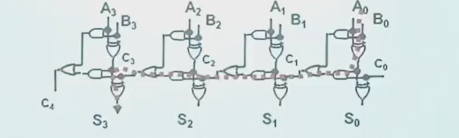
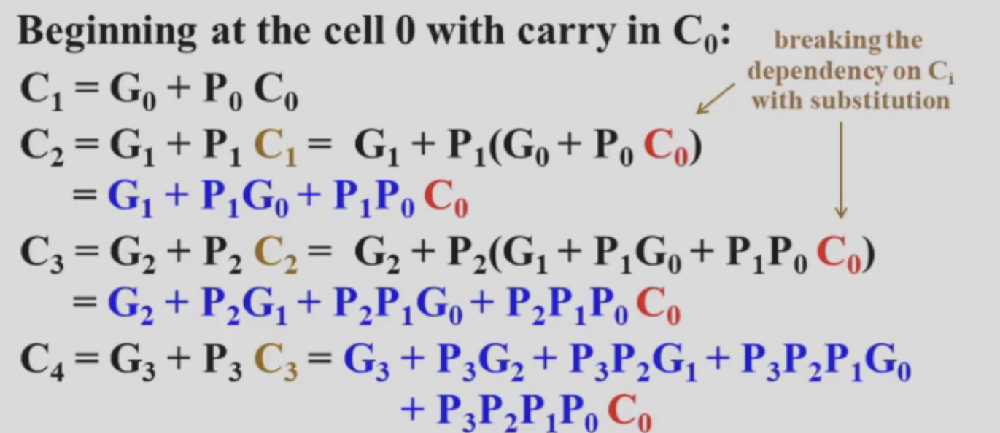
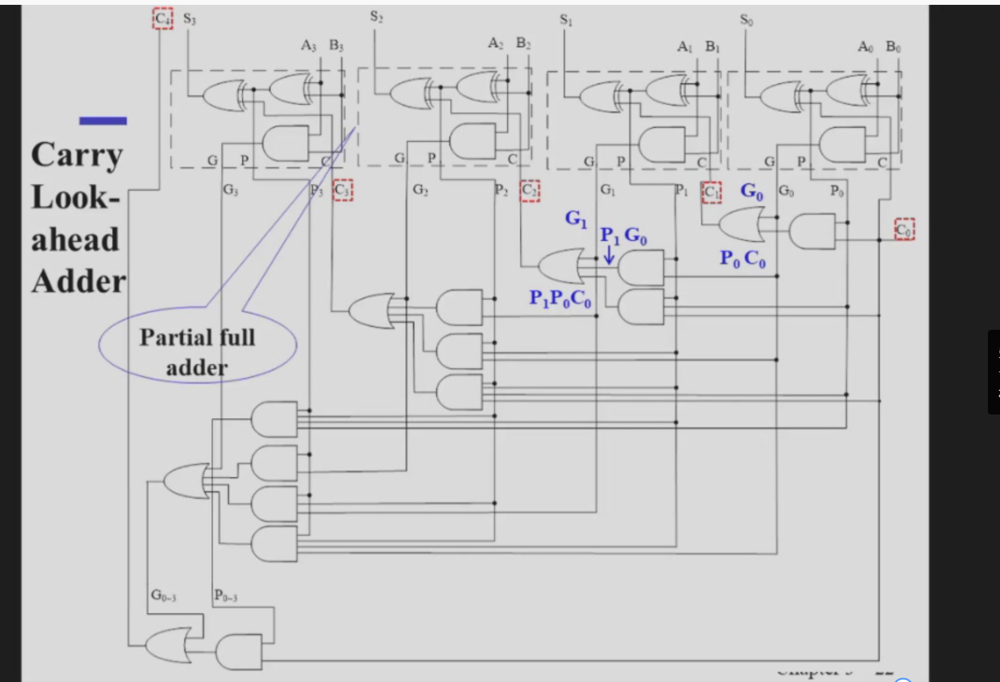
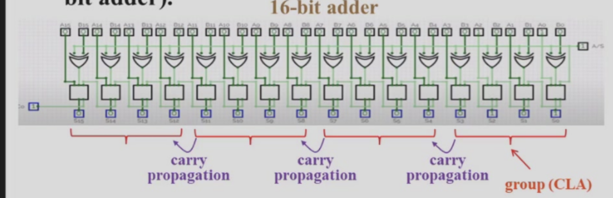

## Arithmetic Calculous

#### 一开始最朴素的想法：
加法器24->13位，（大变小）可以转换为做一个编码器

#### 实现24-13编码器的方式：

不同于使用分治（bisection）的方式，加法设计采用与计算规则相同的迭代组合

总的来说就是模拟人做进位的操作使用functional blocks Addition来实现

1. Half-Adder 2-input bit-wise(按照位的方式) additon
2. Full-Adder 3-input bit-wise addtion
3. Ripple Carry Adder

## Half-Adder
两输入，两输出 三位输入为2个1位二进制数字 输出的一位为和，另一位为进位

## Full-Adder
三输入，两输出 三位输入为3个1位二进制数字 输出一位为和，另一位为进位

S=X xor Y xor Z

C=XY + (X xor Y)Z

之所以写成这种形式的原因：

    方便看出来这是两个半加器的结合
    1. XY is carry generate 高两位都为1的时候直接进位
    2. (X xor Y)Z    X xor Y is carry propagate（传播位） X,Y有且仅有一个是1 还得保证还有一个数字是1 就可以保证会进位

## 使用两个半加器实现一个全加器

通过逻辑表达式解释原因

    将第一个半加器的和作为一个输入，将另外一个数字作为另外一个输入，然后这两个元素做输入输入输入第二个半加器
    
    最后的进位输出可以由两个半加器获得 所以用or 或上两个C的结果

## Binary Adder

将多个Full-Adder串联起来，将前一个的Cout连接上后一个的其中一个输入口
最终输出一个Cout和N位输出

这个加法器有很好的可扩展性(可以做的很大)
## 4-bit Ripple-Carry Binary Adder
Carry Propogation & Delay

     最大的问题就是行波进位的低位的C位的延迟会随着位数的计算不断往高位进位而不断变长

以下一条通路的延时最长

     一个异或门的延迟大于 与+或

时间复杂度 是O（N）

## Revisit the Full Adder

## Carry Lookahead Adder

    耗费时间的是进位

将Cout的表达式完全展开 

C~1~ =G~0~ +P~0~C~0~                 (G~0~=A~0~B~0~,C~0~=A xor B)
C~2~ =G~1~ +P~1~C~1~                 (G~1~=A~1~B~1~,C~1~=A xor B)
将C~1~带入C~2~ 
如下图：

这样就可以将分步骤计算转化为多位计算！！！

这样就可以用O（1）的时间复杂度，先将所有进位先算出来

    这里有一个很明显的缺陷 就是对于高位的fan-in

## Group Carry Lookahead Logic（Cout）

以四个cout为一组 组内的进位优先算出来，但是需要等待前面组cout结果的传递

## 加法器的构建过程
      1. 直接用真值表构建高位输入不可能
      2. 使用行波进位加法器，但是cin的传播延迟时间过长
      3. 使用提前进位加法器（将进位优先计算完成），但是会导致高位的fan-in过高，制作相应硬件的成本过高 
      4. 使用分组提前进位，组间行波仅为

