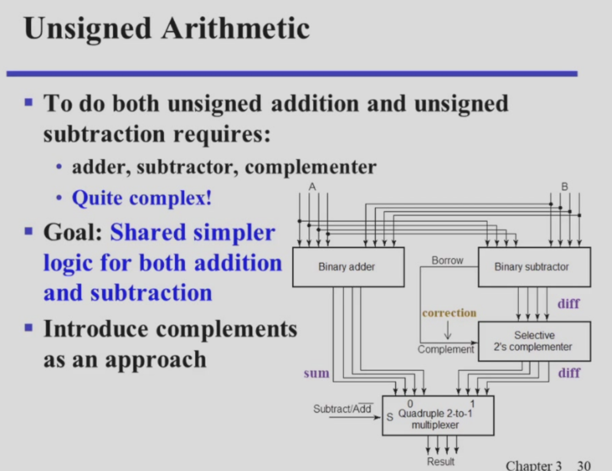
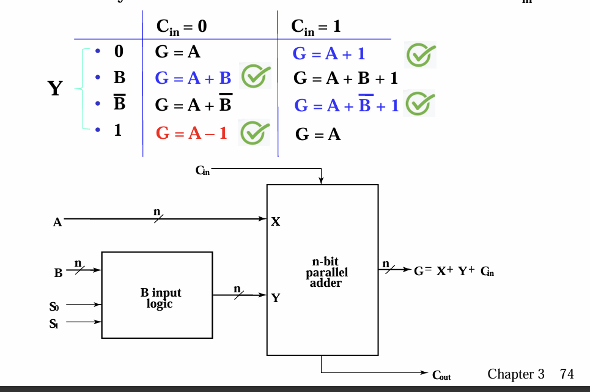

## Usigned Arithmetic

目标是同时实现混合的加减

利用多路选择器选择是输出加的结果，还是减的结果


解释减法模块：

    1. 计算差
    2. 如果借位就取补码/如果不借位就直通


## Binerary Complements 二进制反码快速获得算法
概念：

    反码 按位取反
    补码 按位取反+1

获得反码的算法：

    从低位到高位扫描字符串
    如果遇到0，就照抄，如果一旦遇到第一个1，第一个1不变，后面全部取反

```
原理很简单，就是取反之后后面得0串都会变成1，那么但凡+1，这些1都会因为进位变成0，而后面得字符串因为前面已经进位完成所以不再受影响，依旧保留原来得反码
```
e.g. 0100111000 
取补码得->   1011001000

## Method of Complments

之所以能用补码来实现不够减时求绝对值数字补码的操作：原理为：

    一个数，和其在这一最大数码N下的互补数，除N同余

e.g. (N==12):   
        3-6=-3
        3+(12-6)=9

        
同余的一些性质：


## Signed Integers（符号+绝对值数字）
最高位是符号位，
如果是0 那么这个数字是正的
如果是1 那么这个数字是负的

## Signed-Magnitude Aithmetic
有符号整数加法的规则：

先判断是使用加法器还是减法器：

    对三个数字进行计算：求两个数字的符号位，和代表运算符的数字的和

    S记录一位和 C记录溢出

    if S（只记录一位的和）==0那么就是同号计算，调用加法器
        如果C==1那么就是两个负数相加，最后结果补上前缀1表示为负数
        如果C==0那么就是两正加，前补0表正
    if S==1 那么不同号，那么调用减法器
        对两个数做无符号减法，符号取两数中绝对值大的？？？？
        (细节该怎么实现???)


## 如何将补码数字快速写为十进制的整数

将第一位数字的基向量 看成是负的，换句话说就是第一个数字的权重用对应的负数

e.g. 10101=-2^4^+2^2^+2^0^=-5 这就是补码的答案


#### 注意
    这也就解答了为什么我们将11111........这种最大数字设置表示为负最小负数的原因，因为加入将1111设置为4，那么这个数字就不符合以上的转换逻辑
    
---
---

### 但是这一个计算方式其实还不是最好的

---
---

自然的就会往下思考一步骤：

    既然计算过程中计算减法需要转化为补码后计算加法，那为什么不直接将所有负数都用补码来存储呢？？


## Signed 2’s Complement Arithmetic

1. 先将数字的计算转换为两个数相加
2. 带上符号位进行运算
    1. 如果运算数符号位不一样，那结果不用操作
    2. 如果运算数的符号相同
       1. 如果结果的符号位与运算数字相同，那么结果没溢出
       2. 如果结果的符号位与运算数不同，那么结果发生了溢出


溢出分为两种：

    上溢：符号位0+0=1（整数相加成负数了）
    下溢：符号位1+1=0（负数相加成正数了）

## Signed 2’s Complement Adder/Subtractor

既然会发生溢出，那么我们就需要一个判断方式来检测是否发生溢出：

最直观的逻辑就是按照上面的计算逻辑直接写出逻辑结果：
Overflow=XY(~S )+(~X )(~Y)S；(X,Y,S分别为最后一个全加器的三位输入)

    但是不够简单

用真值表找其他的化简方式：


总共5个输入，有很多don't cares项
化简得最好得方式如下：
Overflow= Z（上一位得Cout） xor C（很明显可以观察这两个真值不同得时候，结果为真）

-> O=C~n-1~ xor C~n-2~


最后得电路就如下：

解释：

    上一排得异或门是用来取反的；
    最下面的异或门使用对是否溢出做判断的；


## Arithmetic Logic Unit(ALU)

我现在需要让以前的算数运算电路进阶，让它可以处理更多的运算

以下是一些详细的功能介绍：

    1. 有两位输入
    2. 模式选择有两种：算数运算  和   逻辑运算
    3. 操作模式的选择：加 减 自增 自减////与 或 非 亦或
    4. 有一位Cin输入和一个Cout输出

实现逻辑运算很简单，只需要一个4路多路选择器就可以


接下来需要处理的是算数运算模块

与之前思考减法时候会想去运用Adder类似

我们思考 inc dec 的思路也是一样的

    利用一个模块来单独的控制B的输入（在减法器里面就是相当于用一个符号位来先与B做运算，从而获得一个合式X+Y）


自增就是+1（用cin=1来实现，此时B全为0）

自减就是-1（用B=1111111....（-1），此时cin=0）


那么为了能同时和平四种计算，就想出来了这么一种神奇的电路逻辑




解释：

    总的表达式就是G = X+ Y+ Cin


设计控制信号的对应的真值表（只有一位）


解释：

    都为零就全为零
    都1就是全1（相当于-1）
    第二个为1（直通，相当于B）
    第一个为1（取反，相当于-B）

---

## Design by Contraction
对于这些基本的算数模块呀，我们其实思考的不仅是要能够借鉴之前已有的模块，从而实现高复用，我们更需要思考如果只有这一个功能的时候如何实现压缩（让电路更简单）


比如针对自增这一个器件：

解释：

    自增是与一个定值去做操作，那么很多器件都可以化简
    1. 与非门，在一个另一个输入恒为1的时候，退化为非门
    2. 同理其他自己思考

## Multiplication by a Constant

首先，乘一个固定的数2^n^，就是将所接位数往高位平移n位

那么要计算*101


就可以拆解为X*4+X*1将结果相加就可以


电路如下：


解释：

    它模拟的是入右图的计算逻辑，所以有些项直接放下来不需要计算


  


    
